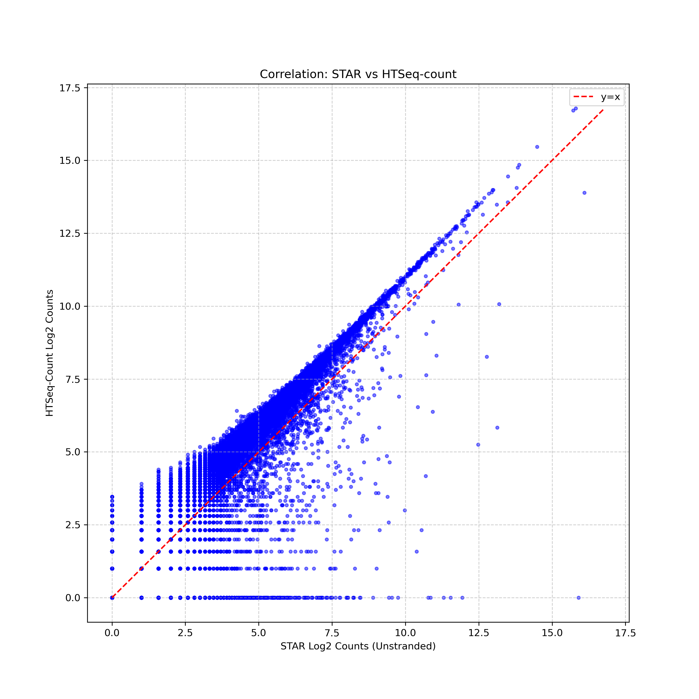

## 🔹 Часть 1. Контроль качества до тримминга (FastQC + MultiQC)

### Проблемы до тримминга:(скрипт номер 1  и 2 )

| Sample             | % Dups   | % GC | Length | % Failed | M Seqs |
|--------------------|----------|------|--------|----------|--------|
| Eg_Treg_S71_R1_001 | 27.7%    | 45%  | 76 bp  | **27%**  | 19.8   |
| Eg_Treg_S71_R2_001 | 21.2%    | 46%  | 76 bp  | **9%**   | 19.8   |
Загрязнено адаптерами и большой процент неудачных прочтений

---

## 🔹 Часть 2. Тримминг с помощью fastp(скрипты 3 4 5)

### Параметры тримминга:
```bash
fastp -i R1 -I R2 -o R1_trimmed -O R2_trimmed \
      -W 5 -M 20 \       # окно 5, порог Q20
      -l 25 \            # минимальная длина 30 п.н.
      --detect_adapter_for_pe \
      -w 4
```

### Результаты после тримминга:

| Sample         | % Dups   | % GC | Length | % Failed | M Seqs |
|----------------|----------|------|--------|----------|--------|
| Eg_Treg_S71_R1 | 26.2%    | 45%  | 75 bp  | **9%**   | 19.0   |
| Eg_Treg_S71_R2 | 22.0%    | 46%  | 75 bp  | **9%**   | 19.0   |

✅ **Улучшения:**
- Failed у R1 снизился с **27% до 9%** 
- Потеря данных составила всего ~4% (с 19.8 до 19.0 млн ридов).
- Длина ридов уменьшилась совсем  чуть чуть


Для последующего выравнивания STAR испорльзую **триммированные файлы**!

---

## 🔹 Часть 3. Выравнивание STAR и сборка транскриптов StringTie


 Зачем нужно - чтобы понять как соотносятся наши риды с референсным геномом
### Выравнивание STAR(скрипт 6)

Результат: файл `RNA_Aligned.sortedByCoord.out.bam`.

### Сборка транскриптов StringTie(скрипт 7)

#### Первые 10 строк GTF-файла:
```
# stringtie /home/STUDY/FBMF/studfbmf02_17/hw_6/results/star/RNA_Aligned.sortedByCoord.out.bam -o /home/STUDY/FBMF/studfbmf02_17/hw_6/results/stringtie/transcripts.gtf -p 4
# StringTie version 2.2.3
1       StringTie       transcript      75902   77168   1000    .       .       gene_id "STRG.1"; transcript_id "STRG.1.1"; cov "5.614519"; FPKM "2.248023"; TPM "4.839379";
1       StringTie       exon    75902   77168   1000    .       .       gene_id "STRG.1"; transcript_id "STRG.1.1"; exon_number "1"; cov "5.614519";
1       StringTie       transcript      91658   92659   1000    .       .       gene_id "STRG.2"; transcript_id "STRG.2.1"; cov "9.284932"; FPKM "3.717637"; TPM "8.003055";
1       StringTie       exon    91658   92659   1000    .       .       gene_id "STRG.2"; transcript_id "STRG.2.1"; exon_number "1"; cov "9.284932";
1       StringTie       transcript      94864   96518   1000    .       .       gene_id "STRG.3"; transcript_id "STRG.3.1"; cov "4.873394"; FPKM "1.951281"; TPM "4.200573";
1       StringTie       exon    94864   96518   1000    .       .       gene_id "STRG.3"; transcript_id "STRG.3.1"; exon_number "1"; cov "4.873394";
1       StringTie       transcript      99112   102057  1000    .       .       gene_id "STRG.4"; transcript_id "STRG.4.1"; cov "4.891146"; FPKM "1.958388"; TPM "4.215875";
1       StringTie       exon    99112   102057  1000    .       .       gene_id "STRG.4"; transcript_id "STRG.4.1"; exon_number "1"; cov "4.891146";
1       StringTie       transcript      266254  269231  1000    .       .       gene_id "STRG.5"; transcript_id "STRG.5.1"; cov "10.274989"; FPKM "4.114050"; TPM "8.856424";
1       StringTie       exon    266254  269231  1000    .       .       gene_id "STRG.5"; transcript_id "STRG.5.1"; exon_number "1"; cov "10.274989";
...
```

**Описание полей GTF:**
1. Хромосома
2. Источник (StringTie)
3. Тип фичи (transcript/exon)
4. Начало
5. Конец
6. Score (всегда 1000)
7. Цепь (+/-)
8. Frame (пусто для экзонов)
9. Атрибуты (gene_id, transcript_id, coverage, FPKM, TPM)

 **Количество транскриптов:**  
`grep -c "transcript" transcripts.gtf` → **184085**

**Зачем transcripts.gtf?**  
Этот файл описывает структуру изоформ, которые реально экспрессируются в образце.

---

## 🔹 Часть 4. Подсчёт каунтов HTSeq-count(скрипт 8)

Команда:
```bash
htseq-count --format bam --order pos --stranded no \
            --type exon --idattr gene_id \
            RNA_Aligned.sortedByCoord.out.bam Homo_sapiens.GRCh38.110.chr.gtf > htseq_counts.txt
```

 **Количество уникальных генов (исключая служебные строки):**  
`grep -v "^__" htseq_counts.txt | wc -l` → **62700**

---

## 🔹 Сравнение STAR vs HTSeq-count



**Корреляция Пирсона:**
Pearson Correlation Coefficient: 0.7468

### Почему результаты могут не совпадать?
- **STAR** считает все риды, выровненные на ген (включая интроны и межгенные области, если они аннотированы).
- **HTSeq** применяет строгие правила: игнорирует риды, попадающие на несколько генов одновременно Поэтому его каунты обычно ниже.

### Что лучше использовать для DE-анализа (DESeq2/edgeR)?

**HTSeq-count** лучше, потому что:  даёт более чистые данные по экзонам.


---

## Скрин с сервера


```
results/qc_after/:
total 1792936
drwxr-xr-x. 3 studfbmf02_17 fbmf        10 May 18 17:22 .
drwxr-xr-x. 7 studfbmf02_17 fbmf         5 May 18 16:38 ..
-rw-r--r--. 1 studfbmf02_17 fbmf    653514 May 18 17:21 Eg_Treg_S71_R1_trimmed_fastqc.html
-rw-r--r--. 1 studfbmf02_17 fbmf    482677 May 18 17:21 Eg_Treg_S71_R1_trimmed_fastqc.zip
-rw-r--r--. 1 studfbmf02_17 fbmf 851258322 May 18 17:15 Eg_Treg_S71_R1_trimmed.fastq.gz
-rw-r--r--. 1 studfbmf02_17 fbmf    655257 May 18 17:21 Eg_Treg_S71_R2_trimmed_fastqc.html
-rw-r--r--. 1 studfbmf02_17 fbmf    488950 May 18 17:21 Eg_Treg_S71_R2_trimmed_fastqc.zip
-rw-r--r--. 1 studfbmf02_17 fbmf 980721328 May 18 17:15 Eg_Treg_S71_R2_trimmed.fastq.gz
-rw-r--r--. 1 studfbmf02_17 fbmf    451919 May 18 17:15 fastp_report.html
-rw-r--r--. 1 studfbmf02_17 fbmf    110765 May 18 17:15 fastp_report.json
drwxr-xr-x. 2 studfbmf02_17 fbmf         4 May 18 17:22 multiqc_data
-rw-r--r--. 1 studfbmf02_17 fbmf   1141629 May 18 17:22 multiqc_report.html

results/qc_before/:
total 3288
drwxr-xr-x. 3 studfbmf02_17 fbmf       6 May 18 17:01 .
drwxr-xr-x. 7 studfbmf02_17 fbmf       5 May 18 16:38 ..
-rw-r--r--. 1 studfbmf02_17 fbmf  617135 May 18 16:44 Eg_Treg_S71_R1_001_fastqc.html
-rw-r--r--. 1 studfbmf02_17 fbmf  489375 May 18 16:44 Eg_Treg_S71_R1_001_fastqc.zip
-rw-r--r--. 1 studfbmf02_17 fbmf  619693 May 18 16:44 Eg_Treg_S71_R2_001_fastqc.html
-rw-r--r--. 1 studfbmf02_17 fbmf  495962 May 18 16:44 Eg_Treg_S71_R2_001_fastqc.zip
drwxr-xr-x. 2 studfbmf02_17 fbmf       4 May 18 17:01 multiqc_data
-rw-r--r--. 1 studfbmf02_17 fbmf 1143548 May 18 17:01 multiqc_report.html

results/star/:
total 2037435
drwxr-xr-x. 2 studfbmf02_17 fbmf          6 May 18 17:45 .
drwxr-xr-x. 7 studfbmf02_17 fbmf          5 May 18 16:38 ..
-rw-r--r--. 1 studfbmf02_17 fbmf 2080256756 May 18 17:45 RNA_Aligned.sortedByCoord.out.bam
-rw-r--r--. 1 studfbmf02_17 fbmf       2030 May 18 17:45 RNA_Log.final.out
-rw-r--r--. 1 studfbmf02_17 fbmf      14687 May 18 17:45 RNA_Log.out
-rw-r--r--. 1 studfbmf02_17 fbmf        600 May 18 17:45 RNA_Log.progress.out
-rw-r--r--. 1 studfbmf02_17 fbmf    1446921 May 18 17:45 RNA_ReadsPerGene.out.tab
-rw-r--r--. 1 studfbmf02_17 fbmf    4610907 May 18 17:45 RNA_SJ.out.tab

results/stringtie/:
total 25322
drwxr-xr-x. 2 studfbmf02_17 fbmf        3 May 18 18:56 .
drwxr-xr-x. 7 studfbmf02_17 fbmf        5 May 18 16:38 ..
-rw-r--r--. 1 studfbmf02_17 fbmf     1467 May 18 18:55 10_genes.txt
-rw-r--r--. 1 studfbmf02_17 fbmf        7 May 18 18:56 transcript_count.txt
-rw-r--r--. 1 studfbmf02_17 fbmf 25926905 May 18 18:30 transcripts.gtf
```

---

## Выводы

1. Исходные данные имели проблемы с качеством (особенно R1), которые успешно устранены триммингом.
2. Trimming сохранил >95% данных, значительно улучшив метрики QC.
3. STAR эффективно выровнял риды на референсный геном GRCh38.
4. StringTie собрал 184085 транскриптов, предоставив детальную аннотацию изоформ.
5. HTSeq-count подсчитал экспрессию 62700 генов, обеспечив чистые данные для DE-анализа.
6. Корреляция между STAR и HTSeq высокая , но HTSeq предпочтительнее для дальнейшего анализа из-за строгой фильтрации.
