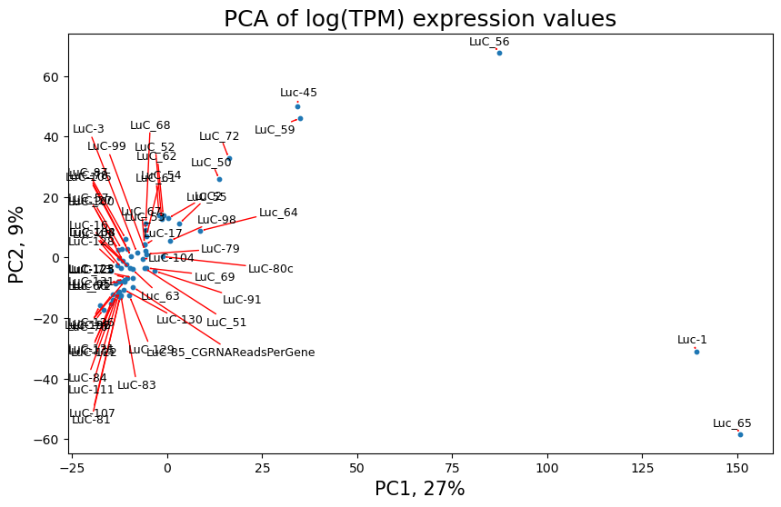
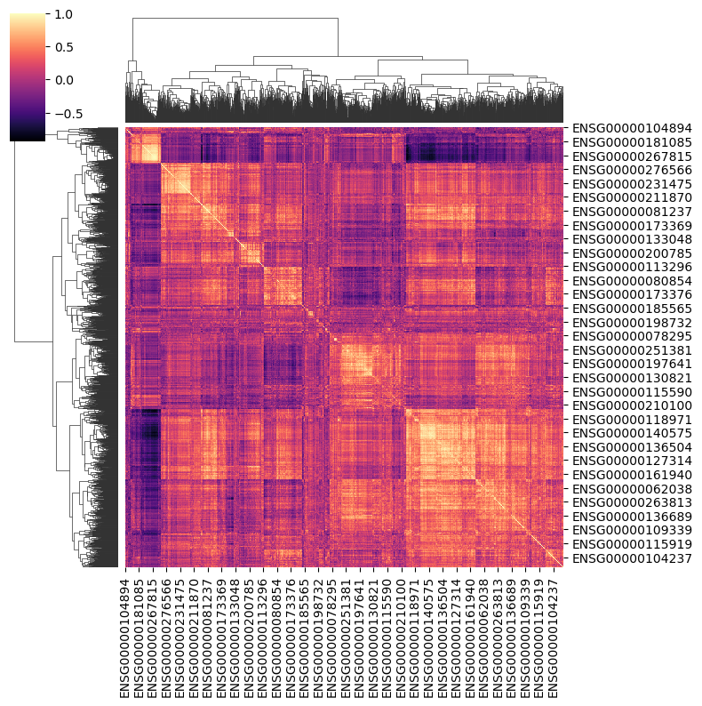
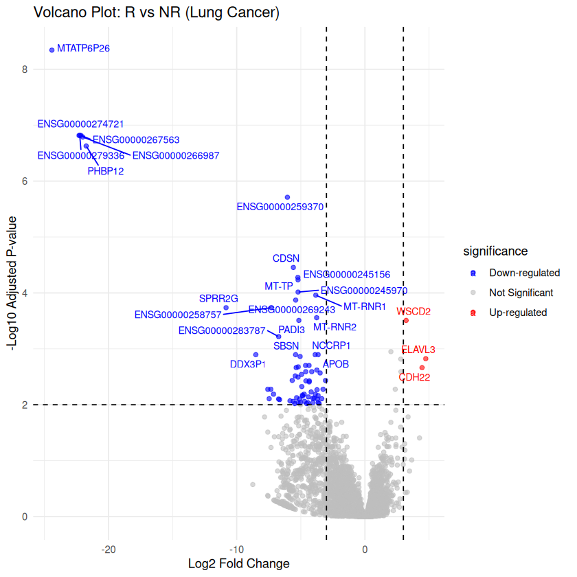
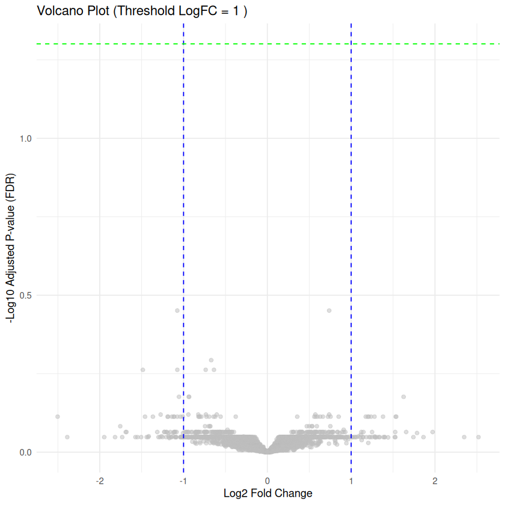
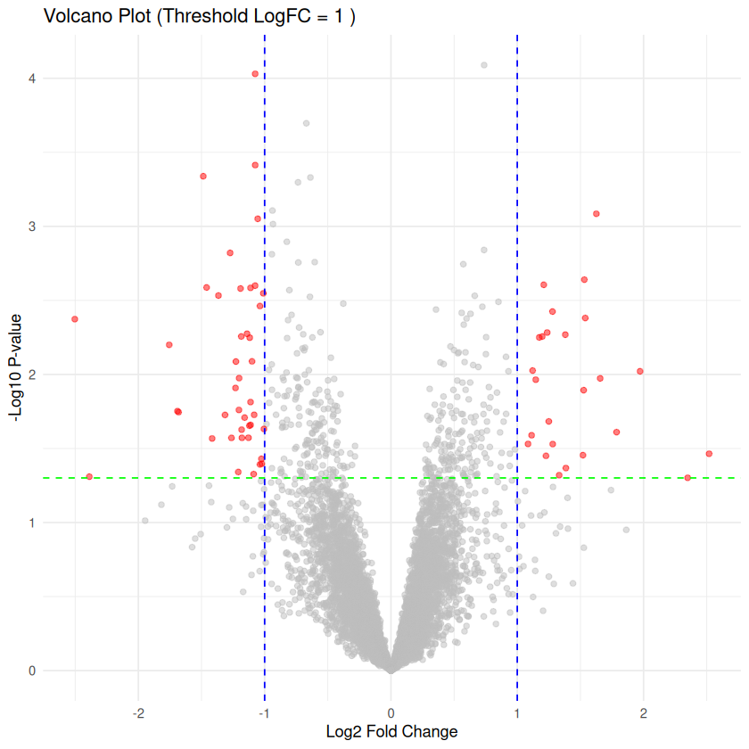
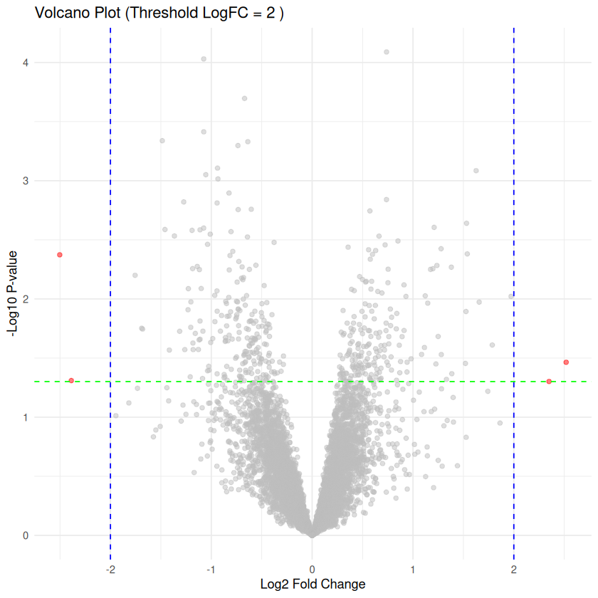
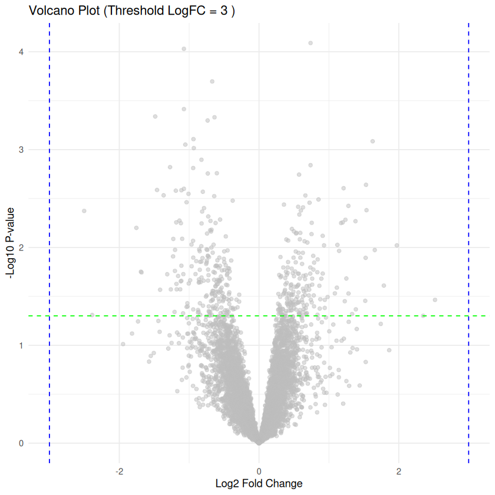

# Задание 7

## Дифференциальная экспрессия генов

### Часть 1 — Анализ дифференциальной экспрессии (DESeq2)
Будем проводить анализ RNA-seq данных с использованием DESeq2 для выявления дифференциально экспрессированных генов.

**1. Проведение PCA**
Был сделан PCA в ноутбуке(TPM_PSA.ipynb), результат  на графике.

**Вывод по PCA:** Нашли выбросы которые ведут себя ненормально, которые можно изучить в дальнейшем анализе

**2. Построение clustermap**

**Вывод по clustermap:** Для оценки сходства между образцами была построена матрица попарных корреляций на основе экспрессии 2000 наиболее вариабельных генов по дисперсии. Использование только высоко-варьирующих генов позволяет снизить влияние шума от слабо экспрессируемых генов и повысить устойчивость кластеризации. Полученная clustermap показывает структурированное разделение образцов, что согласуется с результатами PCA.

**3. Анализ дифференциальной экспрессии**
В ноутбуке с R(да, я решил не заходить в голимый Rstudio и сделал всё ы джупитере) сделал анализ(ноутбук diff_expression)

**4. Визуализация**
Построен volcano plot для результатов дифференциальной экспрессии.

**5. Итоговый вывод по Части 1:**

*  Для оценки дифференциальной экспрессии генов по данным RNA-seq использовался алгоритм **DESeq2**.
* Визуализация данных через PCA и clustermap подтвердила ожидаемую кластеризацию образцов, но выявила выбросы. 
* По результатам работы DESeq2 был сформирован список дифференциально экспрессированных генов, отфильтрованный по строгим порогам: **padj < 0.01** и **|log2FC| > 3**.
* **Итог:** С помощью построения графика volcano plot удалось вихзуализировать стат значимую группу генов.

---

### Часть 2 — Анализ дифференциальной экспрессии (LIMMA)

В данной части проводится анализ дифференциальной экспрессии генов с использованием метода `LIMMA`.

**Цель:**

* Выявить гены, статистически значимо различающиеся между исследуемыми группами образцов.

**Анализ дифференциальной экспрессии:**
Для каждого гена были рассчитаны:

* logFC (log(fold change)).
* p-value.
* adjusted p-value (FDR).
Значимыми считались гены, удовлетворяющие условиям: p-value < 0.05 и |logFC| выше заданного порога.

**проверка по FDR:**

Скорректированный p-value улетел в воздух, значит у нас что-то не так либо с дизайном эксперимента, либо нужно провести какую-то другую поправку на уровень значимости. Но в этот раз возьмём и сделаем неверно, возьмём нескорректированный p-value чтобы получить хоть какие-то резульатты хоть и не стат значимые.

а может это потому, что LIMMA всё таки не для RNA-seq

**Сравнение различных порогов logFC:**
В работе были протестированы три значения порога:

**|logFC| > 1**

**|logFC| > 2**

**|logFC| > 3**

Для каждого варианта было оценено количество 'значимых' генов:

| Порог logFC | Количество 'значимых' генов |
| --- | --- |
| 1 | 67 |
| 2 | 4 |
| 3 | 0 |

При увеличении порога logFC количество 'значимых' генов уменьшается, так как критерий становится более строгим:

* **logFC = 1** позволяет выявить большее число генов, включая умеренные изменения экспрессии.
* **logFC = 2** представляет компромисс между чувствительностью и строгостью отбора.
* **logFC = 3** оставляет только наиболее выраженные изменения, однако может исключать биологически важные гены (в данном случае это пустое множество).

**Вывод**

* При logFC = 1 наблюдается наибольшее количество 'значимых' генов (67), но часть из них может соответствовать слабым биологическим эффектам.
* При logFC = 3 не было 'значимых' генов из-за слишком строгого порога.
* Для данного анализа наиболее оптимальным является порог logFC = 2, так как он позволяет сохранить баланс между количеством найденных генов и выраженностью биологического эффекта.
* Всё таки LIMMA из коробки не подходит для RNAseq - нужно улучшать
